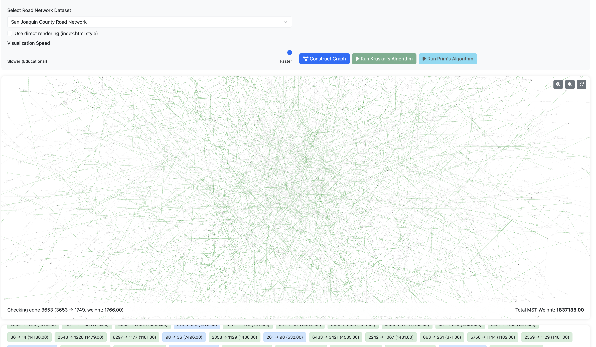
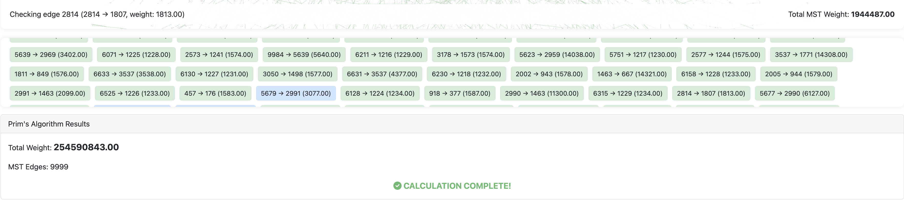

# Road Network MST Visualization

A web-based visualization tool for Minimum Spanning Tree (MST) algorithms on road network datasets.



## Description

This application provides an interactive visualization of Kruskal's and Prim's algorithms for finding the minimum spanning tree in road network graphs. It allows users to select different datasets, visualize the algorithm's execution step-by-step, and see the final MST with the total weight.

## Tech Stack

- **Backend**: Python, Flask
- **Frontend**: HTML, CSS, JavaScript, Bootstrap 5
- **Visualization**: D3.js
- **Data Processing**: Custom implementations of MST algorithms

## Installation and Setup

1. Clone the repository:
   ```
   git clone https://gitlab.bucknell.edu/ndb008/csci311-cityconnections.git
   cd csci311-cityconnections
   ```

2. Install required dependencies:
   ```
   pip install flask numpy pandas networkx matplotlib
   ```

3. Run the application:
   ```
   python app.py
   ```

4. Open a browser and navigate to:
   ```
   http://127.0.0.1:5001 (localhost)
   ```

## Usage

1. Select a road network dataset from the dropdown menu
2. Click "Construct Graph" to load and render the graph
3. Choose either "Run Kruskal's Algorithm" or "Run Prim's Algorithm"
4. Adjust the visualization speed using the slider:
   - Slower: Educational mode with step-by-step visualization
   - Faster: Quick results for larger datasets
5. View the final results in the panel below the visualization



## Algorithm Complexity

### Kruskal's Algorithm
- **Time Complexity**: O(E log E)
- **Space Complexity**: O(E + V)
- Sorts all edges by weight and adds them to the MST if they don't create a cycle, using a Union-Find data structure.

### Prim's Algorithm
- **Time Complexity**: O(E log V)
- **Space Complexity**: O(E + V)
- Grows the MST from a starting vertex, always choosing the minimum weight edge that connects a vertex in the MST to a vertex outside it.

## Features

- Interactive graph visualization with zoom and pan controls
- Step-by-step algorithm visualization
- Real-time updates of total MST weight
- Support for various road network datasets
- Visual celebration upon completion with confetti animation
- Responsive design for different screen sizes

## Contributors

- Duy Le (Bucknell '25)
- Nikita Buzov (Bucknell '25)
- Nhi Cao (Bucknell '25)

## Acknowledgments

- Faculty Advisor: Dr. Talmage
- CSCI 311 - Algorithms & Data Structures, Bucknell University
